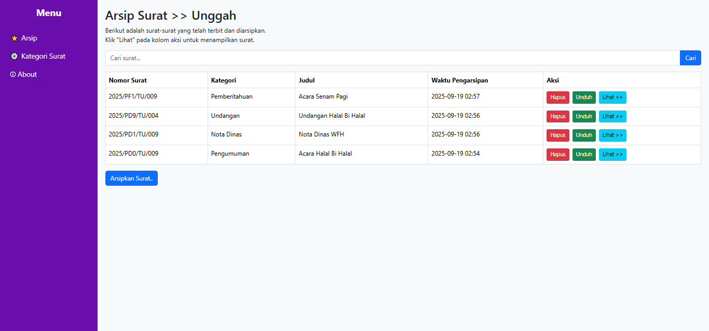
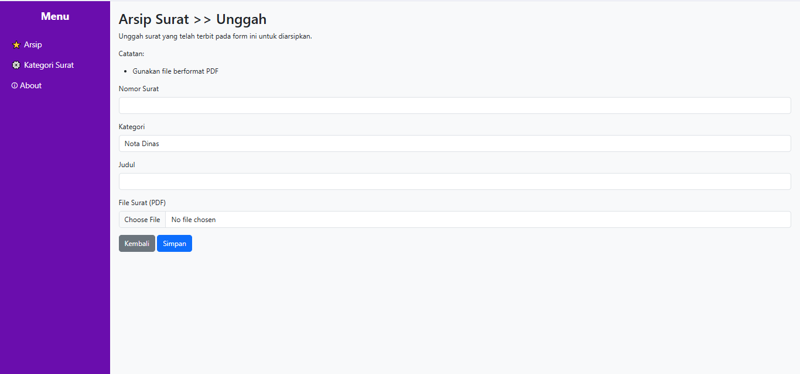
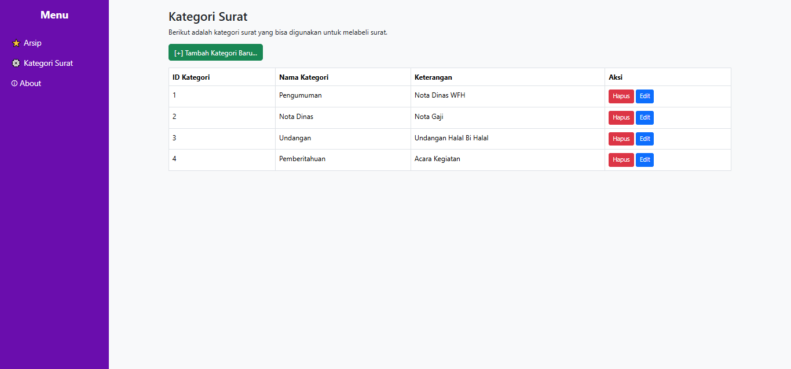
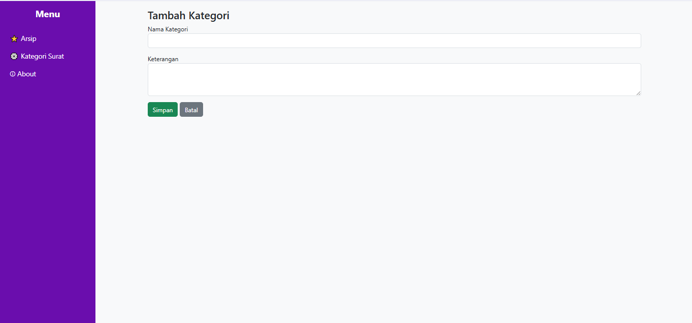

<p align="center">
    <a href="https://laravel.com" target="_blank">
        
    </a>
</p>

<h2 align="center">Sistem Informasi Arsip Surat</h2>

<p align="center">
    <a href="https://github.com/laravel/framework/actions"></a>
    <a href="https://packagist.org/packages/laravel/framework"></a>
    <a href="https://packagist.org/packages/laravel/framework"></a>
    <a href="https://packagist.org/packages/laravel/framework"></a>
</p>

---

## Tentang Project
Aplikasi Arsip Surat ini dibangun dengan Laravel sebagai solusi digital untuk mendukung desa maupun kelurahan dalam mengelola surat masuk dan surat keluar. Sistem ini mempermudah proses pencatatan, penyimpanan, pencarian, serta pengelompokan surat berdasarkan kategori tertentu sehingga pengarsipan menjadi lebih praktis, teratur, dan aman.

---

## Tujuan
- Menyediakan sistem pencatatan arsip surat digital.  
- Mempermudah pencarian arsip dengan fitur filter dan kategori.  
- Mengurangi risiko kehilangan dokumen.  
- Memastikan surat tersimpan dalam format standar (PDF).  

---

## Fitur Utama
- CRUD Surat Masuk & Surat Keluar  
- Upload & Simpan Surat (PDF)  
- Kategori Surat (Penting, Biasa, Rahasia, dll)  
- Pencarian Arsip & Pagination  
- Tampilan sederhana dan mudah digunakan  

---

## Cara Menjalankan
- Clone repository
   ```bash
   **[git clone] https://github.com/meifa10/LSP-Polinema-Meifa-Arsip-Surat.git
   cd arsip-surat
   composer install
   npm install && npm run dev
   php artisan key:generate
   php artisan migrate
   php artisan serve

## Screenshot

### Daftar Arsip


### Form Tambah Surat


### Daftar Kategori


### Form Tambah Kategori


### About
